# Hotel Project using SQL, Excel & BI tools 

## Introduction

In this project I will use MySQL to explore and analyze data and then visualize the data in Tableau to provide insights to the stakeholders.

## Objective
As a data analyst hired by the hotel company to enhance their hotel businesses, my primary focus is to compare their City Hotels with their Resort Hotels. The stakeholders are relying on data-driven insights from me to make informed decisions. Here are some of the questions I will answer:

1. Is hotel revenue growing by year? 
2. Should the hotel increase parking size?
3. What trends can see see with the data?
4. How did COVID affect the hotel business?

## Stakeholders

    1. Janet Do - CEO
    2. Tim Blake - CFO

#### There are four tables in this project named 2018, 2019, 2020, Market and Meal.

## Steps
1.I will utilize SQL to analyze the data and employ queries to merge the dataset into a single table for further cleaning in Excel.
2.Once the final cleaning is completed in Excel, the data will be prepared for visualization using a BI tool.
3.During the visualization stage, I will address the presented questions based on the prepared data.
4.To showcase my skills in both BI tools, I will visualize the data using both Power BI and Tableau.

#### 1a. Using UNION ALL to see combine hotel years 2018-2020 for easier analysis and queries.
```
SELECT * FROM hotel_project.`2018`
UNION ALL
SELECT * FROM hotel_project.`2019`
UNION ALL
SELECT * FROM hotel_project.`2020`;
```
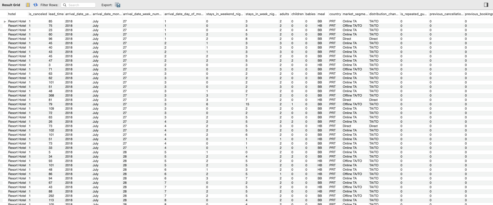<!-- -->

#### 1b.Examining the two other tables
```
SELECT * FROM market;
```
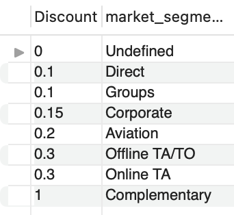<!-- -->
##### This table refers to discounts giving according to market segements 

```
SELECT * FROM meal;
```
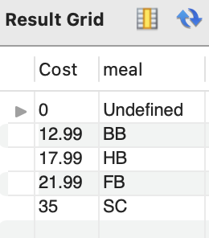<!-- -->
##### This type refers to cost of meal and type of meal.


#### 2. Create a CTE to make querying faster and less tedious 
```
WITH hotels AS (
SELECT * FROM hotel_project.`2018`
UNION ALL
SELECT * FROM hotel_project.`2019`
UNION ALL
SELECT * FROM hotel_project.`2020`
)
SELECT * FROM hotels;
```
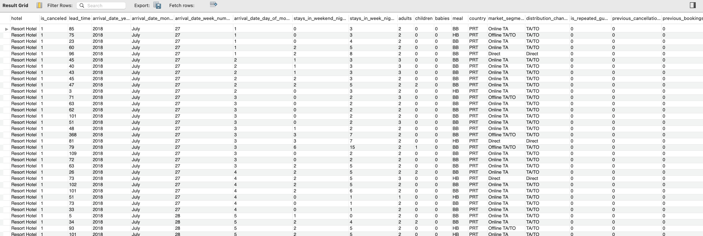<!-- -->

#### 3.Finding the revenue of hotels by adding stays weeks nights and stays weekend * by the average daily rate (adr) rounded to 2 decimals places.
```
WITH hotels AS (
SELECT * FROM hotel_project.`2018`
UNION ALL
SELECT * FROM hotel_project.`2019`
UNION ALL
SELECT * FROM hotel_project.`2020`
)
SELECT round((stays_in_week_nights + stays_in_weekend_nights)*adr,2) revenue FROM hotels;
```
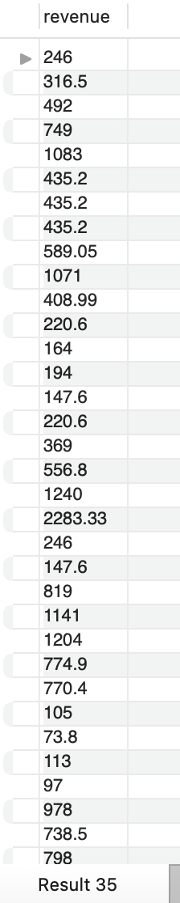<!-- -->

#### 4. Finding the revenue of hotels by year rounded to 2 decimals places
```
WITH hotels AS (
SELECT * FROM hotel_project.`2018`
UNION ALL
SELECT * FROM hotel_project.`2019`
UNION ALL
SELECT * FROM hotel_project.`2020`
)
SELECT arrival_date_year,
ROUND(SUM((stays_in_week_nights + stays_in_weekend_nights)*adr),2) revenue FROM hotels
GROUP BY 1;
```
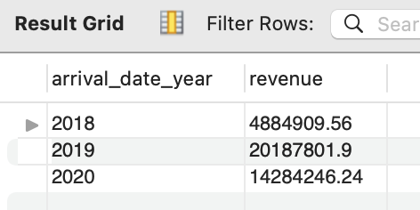<!-- -->

#### 5. Finding revenue by hotel type and year rounded to 2 decimals places 
```
WITH hotels AS (
SELECT * FROM hotel_project.`2018`
UNION ALL
SELECT * FROM hotel_project.`2019`
UNION ALL
SELECT * FROM hotel_project.`2020`
)
SELECT arrival_date_year,
hotel,
ROUND(SUM((stays_in_week_nights + stays_in_weekend_nights)*adr),2) revenue FROM hotels
GROUP BY 1,2
ORDER BY 2;
```
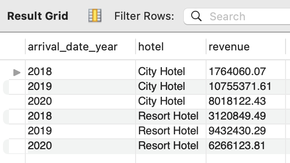<!-- -->

#### 6. Examining the results 2020 data doesn't seem to be complete. Too make sure I will use this query.
```
WITH hotels AS (
SELECT * FROM hotel_project.`2018`
UNION ALL
SELECT * FROM hotel_project.`2019`
UNION ALL
SELECT * FROM hotel_project.`2020`
)
SELECT arrival_date_week_number,arrival_date_year,arrival_date_month
FROM hotels
WHERE arrival_date_year='2020'
ORDER BY 1 DESC,2,3;
```
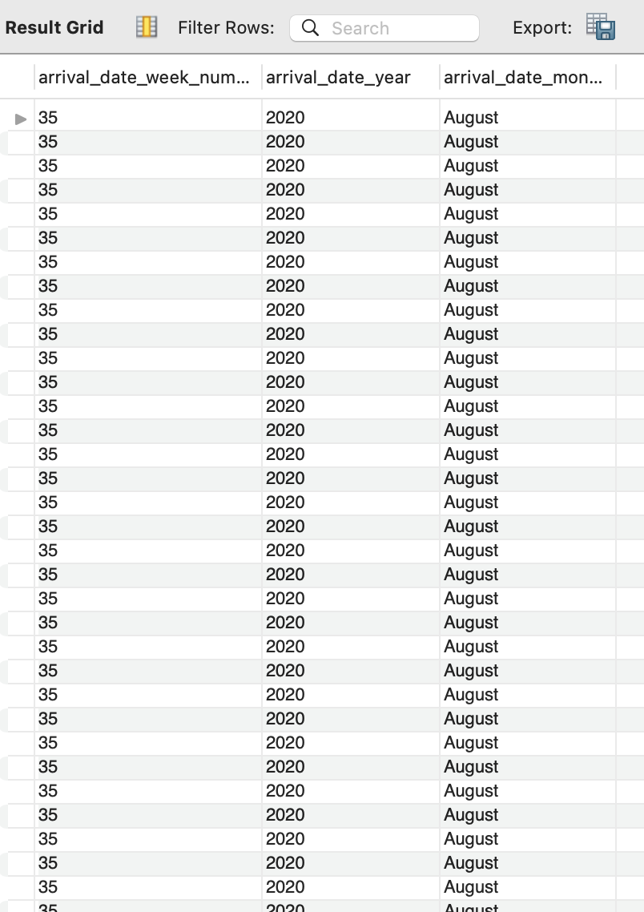<!-- -->

##### Indeed 2020 dataset is incomplete as the last month is August.

#### 7. Now I will use left join CTE table hotels with table market to examine discounts given per market segment
```
WITH hotels AS (
SELECT * FROM hotel_project.`2018`
UNION ALL
SELECT * FROM hotel_project.`2019`
UNION ALL
SELECT * FROM hotel_project.`2020`
)
SELECT * FROM hotels
LEFT JOIN market
ON hotels.market_segment=market.market_segment;
```
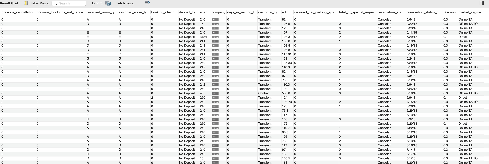<!-- -->

#### 8. Now I will use a add another left join to join the meal table
```
WITH hotels AS (
SELECT * FROM hotel_project.`2018`
UNION ALL
SELECT * FROM hotel_project.`2019`
UNION ALL
SELECT * FROM hotel_project.`2020`
)
SELECT * FROM hotels
LEFT JOIN market
ON hotels.market_segment=market.market_segment 
LEFT JOIN 
meal ON hotels.meal=meal.meal;
```
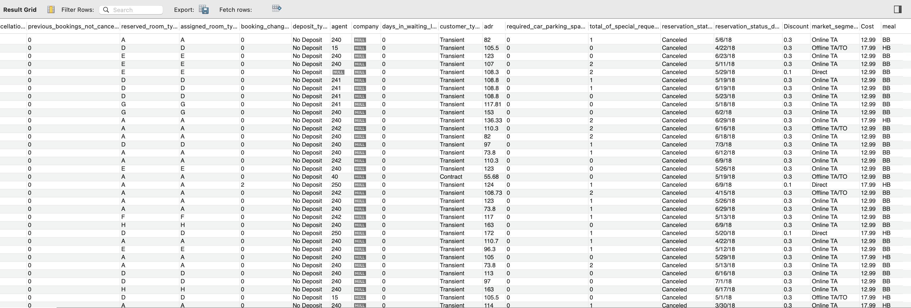<!-- -->

#### 9. Now data is ready to be exported into a CSV file and loaded into Excel for further cleaning and then loaded into a BI tool to be visualized into a dashboard.

[Tableau Link To Dashboard](https://public.tableau.com/views/Hotel_Project_Tableau_16903284335380/Dashboard1?:language=en-US&:display_count=n&:origin=viz_share_link)

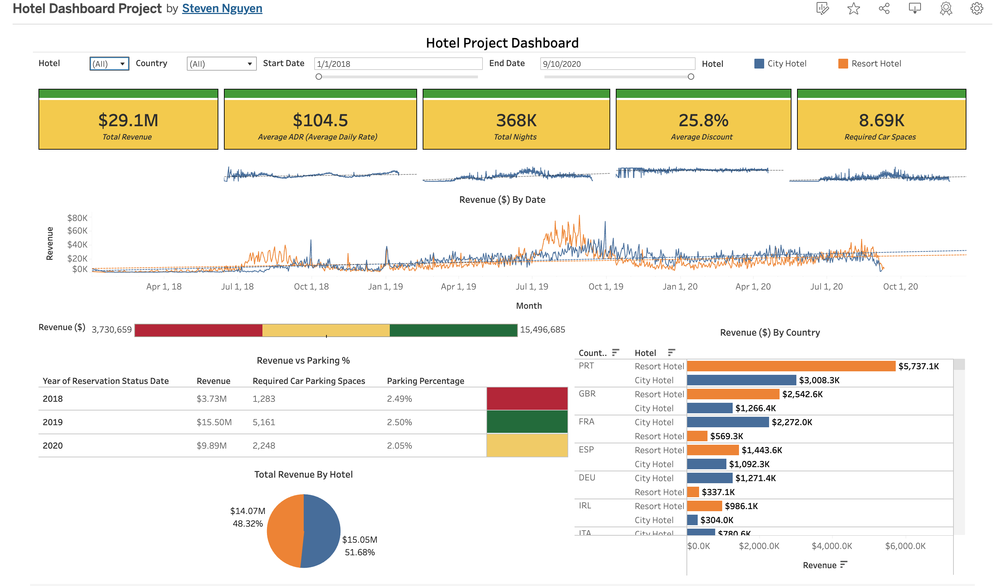<!-- -->

***PowerBI link coming soon...***

## Final Insights
* The hotels have earned a total of $29.1M with an average discount of 25.8% and an Average Daily Rate of $104.50 from 2018 to Sep. 2020.
* The data for the year 2020 is incomplete as it only includes data up to September of 2020.
* City Hotels have earned $15M with an average discount of 26.7%, 187,000 customer nights, 2100 required parking spaces, and an Average Daily Rate of $108.7 from 2018 to Sep. 2020.
* Resort Hotels have earned $14.1M with an average discount of 24.5%, 180,000 customer nights, 6059 required parking spaces, and an Average Daily Rate of $98.2 from 2018 to Sep. 2020.
* It appears that COVID had a significant impact on resort hotels, as there was a steep decrease from the summer of 2019 to 2020.
* Revenue seems to be increasing every year, even with 2020 revenue data only up to early September. It looks like it will surpass 2019 revenue, but not by much. We also have to factor in the effects of COVID, as the lockdowns in 2020 greatly affected hotel revenue, especially for resort hotels during the summer when people were unable to travel abroad and stay in resort hotels.
* City Hotels are the highest-earning hotels, probably due to the lockdowns in 2020 that prevented many people from traveling abroad.
* Looking at the parking percentage over the years, it appears that the hotels don't need to build more parking spaces.
* Portugal is the country with the largest customer base, with the hotels making $8.7M, with $5.7M from resort hotels and $3M from city hotels.
* Portuguese customers bring in more than twice the revenue as the second-largest customer group, the U.K., with U.K. customers accounting for only $3.7M in total hotel revenue.
